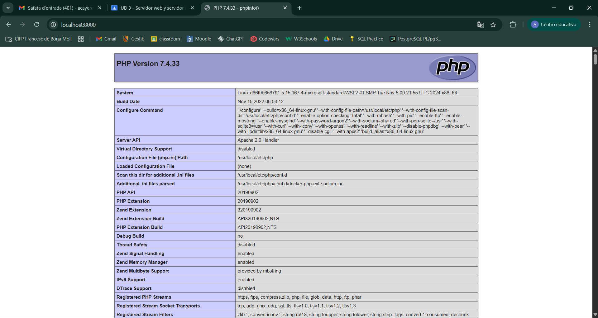
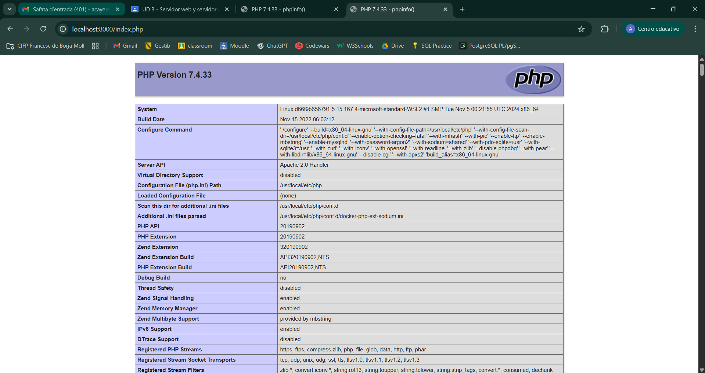
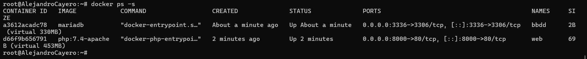
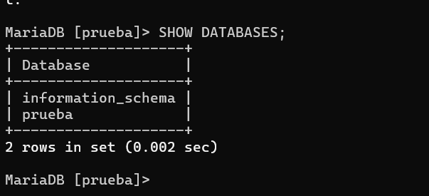
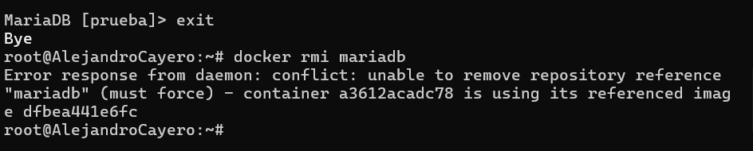

Alejandro Cayero

A continuación se presentan las capturas de pantalla solicitadas para la entrega del proyecto.

---

### 1. Pantallazo del fichero `index.html`

---

### 2. Pantallazo del fichero `index.php`

---

### 3. Pantallazo del tamaño del contenedor `web`

---

### 4. Pantallazo de la conexión a la base de datos

---

### 5. Pantallazo del error al borrar la imagen `mariadb`

